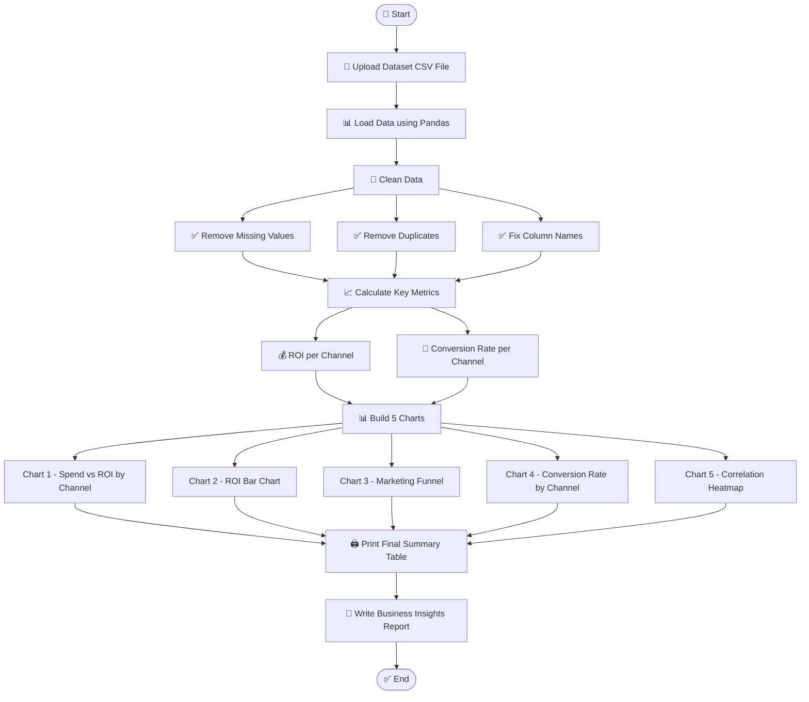

 📊 Marketing Campaign Performance — Exploratory Data Analysis

A data analysis project that explores marketing channel performance using Python.  
The goal is to find out which marketing channels give the best return on investment and recommend where the budget should be increased or reduced.

📌 Project 

This project analyzes a real-world marketing campaign dataset to answer one simple business question:

> Which marketing channels are actually worth spending money on

We clean the data, calculate ROI and Conversion Rate for each channel, build 5 charts, and write a business report with clear budget recommendations.

🚀 Features
- Loads and cleans real marketing campaign data
- Calculates ROI and Conversion Rate per marketing channel
- Builds 5 professional charts for visual analysis
- Prints a final summary table with all key metrics
- Provides clear budget recommendations based on data

🛠️ Technologies Used

| Tool | Purpose |
|---|---|
| Python | Main programming language |
| Pandas | Data loading, cleaning, and analysis |
| Matplotlib | Building bar charts and funnel charts |
| Seaborn | Conversion rate chart and heatmap |
| Google Colab | Running the notebook in the browser |
| GitHub | Storing and sharing the project |

🔄 Workflow Flowchart


📂 Project Structure

```
marketing-campaign-eda/
│
├── 📓 marketing_campaign_eda.ipynb
│
├── 📁 outputs/
│   ├── 🖼️ chart1_spend_vs_roi.png
│   ├── 🖼️ chart2_roi_by_channel.png
│   ├── 🖼️ chart3_funnel.png
│   ├── 🖼️ chart4_conversion_rate.png
│   └── 🖼️ chart5_heatmap.png
│
└── 📄 README.md
```
 📊 Output
 
Here are the 5 charts generated from this project:

Chart 1 — Total Spend vs Average ROI by Channel

Chart 2 — Average ROI by Channel

Chart 3 — Marketing Funnel

Chart 4 — Conversion Rate by Channel

Chart 5 — Correlation Heatmap


📚 Learning Outcomes

By completing this project, I learned how to:
- Load and clean a real-world dataset using Pandas
- Calculate business metrics like ROI and Conversion Rate from raw data
- Build and customize charts using Matplotlib and Seaborn
- Read a correlation heatmap and understand relationships between variables
- Think like a Business Analyst and translate numbers into decisions
- Structure and document a data analysis project on GitHub

🎯 Conclusion

This project shows that not all marketing channels perform equally.  
By analyzing ROI and Conversion Rate per channel, we can clearly see which channels deserve more budget and which ones are wasting money.

Data-driven budget decisions like these can significantly improve a company's overall marketing returns without increasing total spend.

 📁 Dataset

This project uses the **Marketing Campaign Performance Dataset** from Kaggle.

🔗 Download here: [Marketing Campaign Performance Dataset](https://www.kaggle.com/datasets/manishabhatt22/marketing-campaign-performance-dataset)


 
